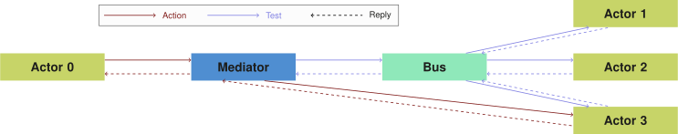

# Comunica

This document provides a complete overview of the [Comunica project](https://github.com/comunica/comunica).

_If you are only interested in executing SPARQL queries,
please refer the [Comunica SPARQL Init Actor README](https://github.com/comunica/comunica/tree/master/packages/actor-init-sparql)._

## Overview
Comunica provides a way to create a program by combining multiple independent building blocks.
These building blocks get linked together based on configuration files,
as defined by [Components.js](https://www.npmjs.com/package/lsd-components).
The primary goal of Comunica is to provide a modular implementation
of a [Triple Pattern Fragments Client](http://linkeddatafragments.org/software/),
but the core can be used for all kinds of projects that require modular problem-solving.
Additionally, new modules can be added to support more than just the basic TPF implementation.

## Building blocks

The Comunica building blocks are called *Actors*.
These Actors define the format of the input they accept and the corresponding output they produce.

Actors communicate with each other through *Buses*.
A Bus combines all Actors that support the same input and output format,
and allows sending messages to all Actors registered to that Bus.
Meaning that if an Actor requires a certain action to be executed on the data it has,
it goes through the corresponding Bus instead of trying to contact another Actor.
This allows for the building blocks to be more independent.

If an Actor requests a response through a Bus, it usually only requires one single response.
This is where *Mediators* come in.
A Mediator wraps around a Bus and makes sure that every request only gets one response.
How a Mediator does this depends on the implementation.
For example, this could be based on simply choosing the Actor that responds first,
or by taking the Actor with the lowest cost estimate (more on this in the Mediator section).

The interfaces for these main 3 components are defined in the
[`core` module](core.md) of Comunica.
All other modules extend the interfaces provided by `core`.

!!! note
    All building blocks are available in separate (npm) modules, for which we use the following naming convention:

    * Bus types: `@comunica/bus-[name-of-bus-type]`
    * Mediator types: `@comunica/mediatortype-[name-of-mediator-type]`
    * Mediators: `@comunica/mediator-[name-of-mediator]`
    * Actors: `@comunica/actor-[name-of-bus-type]-[name-of-actor]`

## Components.js
[Components.js](https://www.npmjs.com/package/componentsjs) is a dependency injection library that allows
the instantiating and interlinking of software components instead of having to do this in the code itself.
This way the components can be built (and linked) independently.
For a full explanation of how this works we refer to the corresponding
[documentation](http://componentsjs.readthedocs.io/en/latest/).

All configuration files are written in RDF, specifically JSON-LD,
allowing people more familiar with JSON than RDF to also quickly pick up the framework.

Several config files are required when using Components.js:

 * A config file for every JavaScript class that gets exposed in the module.
 * A config file combining all the exposed classes.
 * A config file defining the instantiations and how they get combined.

!!! note
    The Components.js convention is to split up these config file.
    However, this is not a requirement. As these just contain RDF, they could be split up or combined in any way.
    Specific examples will be shown in the later sections.

## Motivation: a modular TPF client
The main idea behind Comunica is to create a modular [Triple Pattern Fragments client](http://linkeddatafragments.org/software/).
Many [additions and changes](http://linkeddatafragments.org/publications/) have already been made
based on the original TPF idea.
Combining some of these ideas together and keeping them up to date with the main client implementation
has always been a hassle.
This is where the Comunica client comes in: all modules are written independently,
greatly reducing the dependencies on each other and allowing for easier interoperability.
E.g., an update that provides faster results for triple existence checks can now be used
by adding a module that handles those kinds of patterns,
instead of having to rewrite some of the core functionality.
