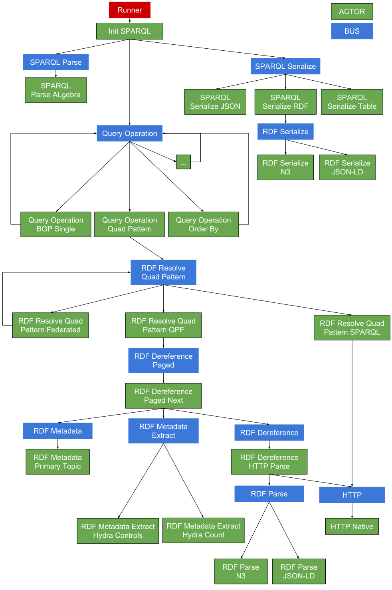

# Executing a SPARQL query

SPARQL queries can easily be executed using the
[`actor-init-sparql`](https://github.com/comunica/comunica/tree/master/packages/actor-init-sparql)
module.

The easiest way to get started is by installing the module as follows:

```bash
$ [sudo] npm install -g @comunica/actor-init-sparql
```

After that, SPARQL queries can be executed as follows:

```bash
$ comunica-sparql http://fragments.dbpedia.org/2015-10/en "CONSTRUCT WHERE { ?s ?p ?o } LIMIT 100"
```

Further documentation for that can be found in the corresponding
[README](https://github.com/comunica/comunica/blob/master/packages/actor-init-sparql/README.md).

## Data Flow
Here we will describe how the packages interact when solving a SPARQL query,
based on the default configuration of
[`actor-init-sparql`](https://github.com/comunica/comunica/tree/master/packages/actor-init-sparql).
The diagram below shows most of the main components that get used and how they interact with each other.



Below we will give a general overview of the functions these blocks fulfill.

### Init SPARQL actor
This actor is the entrypoint.
The intialization actor takes care of reading the input and parsing the command line arguments.
There are 3 busses that get contacted:

 * **SPARQL Parse** to parse the input SPARQL string and convert it to SPARQL algebra.
 * **Query Operation** that takes the algebra as input and converts it into a stream of binding results.
 * **SPARQL Serialize** to convert the the output to the requested format.

Currently there is only 1 parser actor in Comunica.
For the serialization there are more choices,
depending on what is preferred and if the output are bindings or triples (in case of a CONSTRUCT query).

### Query Operation bus
All actors listening on this bus take care of the possible algebra operations:
there is an actor that solves project functions,
one for joining, for BGPs, etc.
In turn, many of them also call the Query Operation bus to solve the nested functions of the algebra,
and then act on the binding results of those nested functions.

Specifically the BGP actor is the one that executes the algorithm on how to best resolve the patterns,
similarly as the original TPF algorithm.

One actor that does not call the bus again is Quad Pattern actor,
which takes care of resolving single patterns.
This is always a leaf node in the algebra tree,
and is responsible for getting the actual TPF results.

### Resolve Quad Pattern bus
All actors in this bus take a quad pattern as input and return the corresponding bindings (and metadata).

The **SPARQL resolver** transforms the pattern to a SPARQL query containing that pattern and sends it to an endpoint to get the results.
Additionally, a COUNT query gets sent to get the total number of results before resolving the entire stream.

The **Federated resolver*** splits up the request:
for each available source a new request gets generated that gets sent back to the bus.
Additionally a cache gets kept for each source to track which source can answer what pattern.

Finally, the **QPF resolver** gets it bindings through TPF (or QPF),
just like the original TPF client does.
A stream gets created that can return all corresponding triples,
by requesting the next page before the previous one is finished.
The resulting triples then get sent to a metadata actor,
to separate the metadata triples from the actual data.
From that metadata the TPF controls and metadata get extracted.
That combination of metadata and bindings then gets sent back as a result.
